# 安装与启动

## 概述

安装 Claude Code 需要两步：**第一步装 Claude Code CLI 本身**，**第二步通过 CC Switch 配置公司提供的 API Key**。两步都完成后，你在终端里输入 `claude` 就能开始使用。

> **类比**: 装 Claude Code 像装编译器（GCC/Keil），装 CC Switch 像配置编译器的工具链路径。只装编译器不够——你还得告诉工具"去哪找 AI 模型"，CC Switch 就是管这件事的。

**前置要求**：
- 一台能访问外网的 Windows 电脑
- **必须已安装 Git for Windows**（Claude Code 依赖 Git，未装会导致启动报错）

> 如果你不确定有没有装 Git：打开终端，输入 `git --version`。如果输出 `git version 2.x.x` → 已装。如果提示 `command not found` → 去 [git-scm.com](https://git-scm.com/download/win) 下载安装，安装时一路默认选项即可。

---

## 段 1：安装 Claude Code CLI

### 1.0 确保终端就绪

本文所有命令在 **PowerShell** 或 **命令提示符** 中执行。建议使用 PowerShell（Windows 10/11 自带），避免使用第三方终端如 Cmder 或 ConEmu（它们可能不共享系统 PATH）。

### 1.1 检查 Node.js 版本

Claude Code 依赖 Node.js 18+。先检查你有没有：

```bash
node --version
```

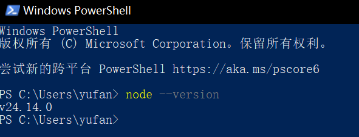

**如果输出 `v18.x.x` 或更高**（`v20`、`v22` 等）→ 继续下一步。

**⚠️ 常见卡点：Node.js 版本不够或未安装**

| 现象 | 自救方案 |
|------|---------|
| `node: command not found` | 没装 Node.js。去 [nodejs.org](https://nodejs.org) 下载 LTS 版本（左侧绿色按钮），安装后重开终端 |
| 版本是 `v16` 或更低 | 去 [nodejs.org](https://nodejs.org) 下载最新 LTS 版本覆盖安装，安装后重开终端再检查 |
| 公司电脑无法访问 nodejs.org | 联系 IT 通过内部软件源安装 Node.js 18+ |

### 1.2 安装 Claude Code

```bash
npm install -g @anthropic-ai/claude-code
```

> ⚠️ **安装后不要马上验证**——全局安装需要终端重新加载 PATH。先**关闭当前终端，重新打开一个新终端**，然后再进入下一步验证。跳过这步你可能遇到 `claude: command not found`。

**⚠️ 常见卡点：npm 安装报错**

| 现象 | 自救方案 |
|------|---------|
| `EACCES: permission denied` | npm 全局目录权限问题。**不要用"以管理员身份运行"**（会导致后续权限混乱）。推荐：安装 `nvm-windows` 来管理 Node.js，nvm 会把全局包放在用户目录下，不再有权限问题。临时方案：`npm config set prefix "%USERPROFILE%\npm-global"` 然后把这个路径加入 PATH |
| `npm: command not found` | npm 随 Node.js 一起安装，说明 Node.js 安装有问题。卸载后重新从 nodejs.org 安装 LTS 版本 |
| 公司网络慢/超时或代理阻断 | 先试：`npm config set registry https://registry.npmmirror.com`（恢复：`npm config delete registry`）。如果镜像也不通（企业代理环境）：设置代理 `npm config set proxy http://proxy.company.com:8080`（地址问 IT）。还不行：请 IT 开白名单或提供内部 npm 源 |
| 安装完claude后运行claude出现报错：npm :无法加载文件 c:\Program Files\nodejs\npm.ps1，因为在此系统上禁止运行脚本。有关详细信息，请参阅 https:/go.microso<br/>com/fwlink/?LinkID=135170中的about Execution Policies。<br/>所在位置 行:1 字符:1<br/>-g @anthropic-ai/claude-code<br/>npm instal1<br/>+ CategoryInfo<br/>SecurityError:(:)，PsSecurityException<br/>+ FullyQualifiedErrorId :<br/>UnauthorizedAccess | 这个主要是无法加载文件，因为在此系统上禁止运行脚本，执行以下命令即可：`Set-ExecutionPolicy -Scope CurrentUser -ExecutionPolicy RemoteSigned`。这句话的意思是**修改 PowerShell 脚本的执行策略**，具体来说是**允许当前用户运行本地脚本，并对从网络下载的脚本进行数字签名验证**。 |
| 安装时杀毒软件拦截 | Windows Defender 等可能锁定 npm 缓存目录。临时禁用实时保护后再装，装完恢复。或添加 `%APPDATA%\npm` 到杀毒软件排除列表 |

### 1.3 验证安装

```bash
claude --version
```

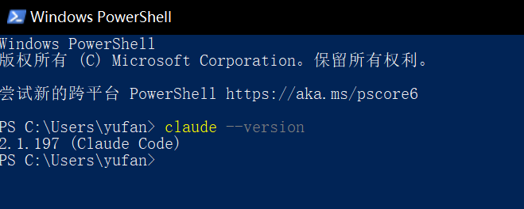

如果看到版本号（如 `v1.0.x`），安装成功。**现在直接输入 `claude` 会提示需要登录——但我们不用官方登录，而是通过 CC Switch 配置公司 API Key。** 所以下一步装 CC Switch。

---

## 段 2：通过 CC Switch 配置公司 API Key

> **CC Switch 是什么**：一个开源桌面应用，用来管理 AI 编程工具的供应商配置。它的工作原理是修改 Claude Code 的环境变量（`ANTHROPIC_BASE_URL` 和 `ANTHROPIC_AUTH_TOKEN`），让 Claude Code 的 API 请求发到公司指定的供应商而不是 Anthropic 官方——你不需要手动编辑任何配置文件。
>
> > 💡 **理解这个机制很重要**：如果 CC Switch 出了问题，你可以手动设置这两个环境变量来绕过——等于你有了一个应急后备方案。`ANTHROPIC_BASE_URL` = 供应商的 API 地址，`ANTHROPIC_AUTH_TOKEN` = 你的 API Key。

### 2.1 下载 CC Switch

1. 打开浏览器，访问：**https://github.com/farion1231/cc-switch/releases**
2. 在最新 Release 的 Assets 列表中找到 **`CC-Switch_*.msi`** 安装包
3. 下载并双击安装

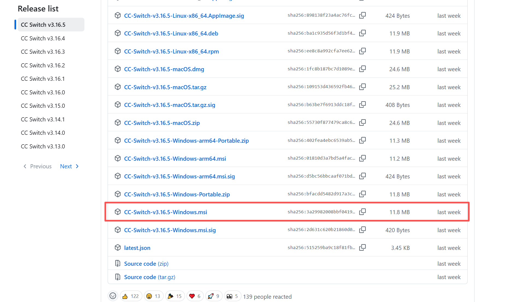

> ⚠️ **Windows SmartScreen 警告**：双击 `.msi` 后 Windows 大概率弹出"Windows 已保护你的电脑"蓝色警告框。这是正常的——CC Switch 是开源小众软件，微软还没收录其签名。点击「更多信息」→「仍要运行」即可继续安装。

> 如果你偏好便携版（免安装），也可以下载 `.zip` 文件解压直接运行。

> ⚠️ **关于系统托盘**：CC Switch 启动后**会最小化到系统托盘**（任务栏右下角），不是完全退出。关闭主窗口 ≠ 退出应用——CC Switch 必须在后台运行才能生效。右键系统托盘图标可以真正退出。

> **CC Switch 的功能不止供应商管理**——它还集成了 MCP 管理、Skills 管理、会话管理、提示词管理等功能。下面逐个看会用到的部分。
>
> 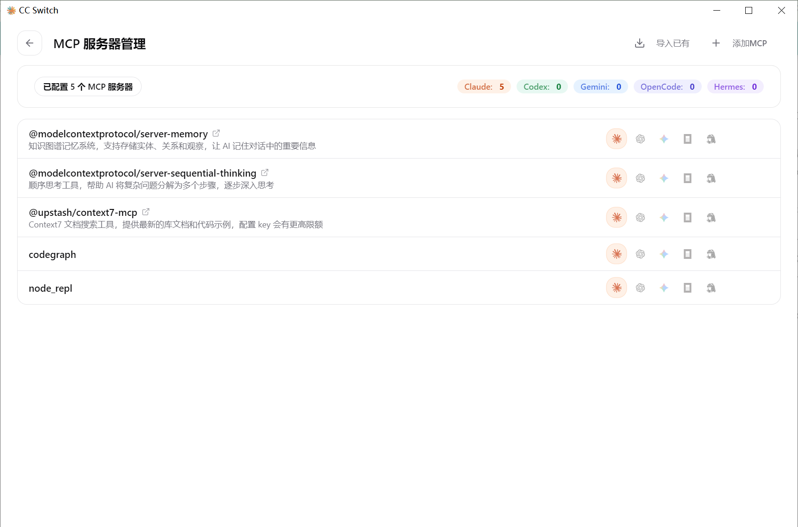
>
> 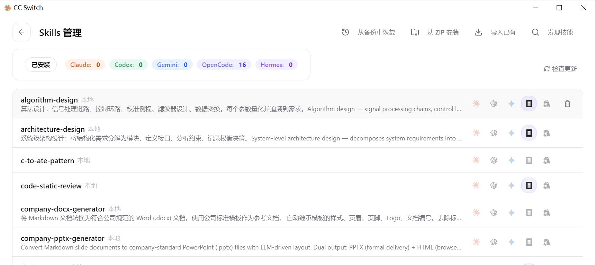
>
> 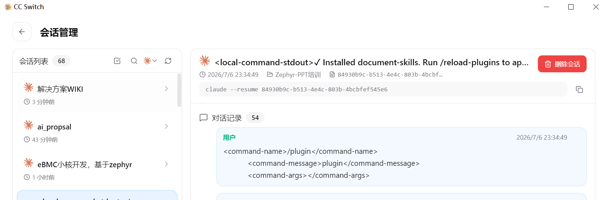
>
> 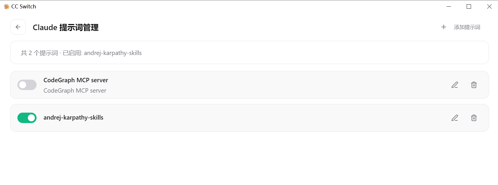

### 2.2 获取公司 API Key

公司通过 **new-api** 平台统一管理 AI 模型的 API 访问。new-api 是一个开源的 AI 模型中转网关——它把多家模型供应商（Claude、GPT、DeepSeek 等）聚合到一个统一入口，公司员工通过它获取 API Key 来使用 Claude Code。

**获取步骤**：

1. 打开浏览器，访问公司内部的 new-api 平台地址（ `http://192.168.21.155:3000`）
2. 用公司账号登录（自己通过公司邮箱注册）
3. 进入「令牌」或「API Keys」页面
4. 点击「创建新令牌」——会生成一串 API Key（格式类似 `sk-xxxxxxxx`）
5. **复制这个 Key**——下一步在 CC Switch 中使用

> ⚠️ **API Key 只在创建时显示一次**——复制后妥善保存。如果丢失，需要在 new-api 平台重新创建。

### 2.3 通过 CC Switch 添加供应商

1. 从开始菜单启动 **CC Switch**（或在系统托盘中找到它的图标）
2. 点击右上角 **`+`** 按钮
3. 在「预设」下拉框中选择 **「Custom」**

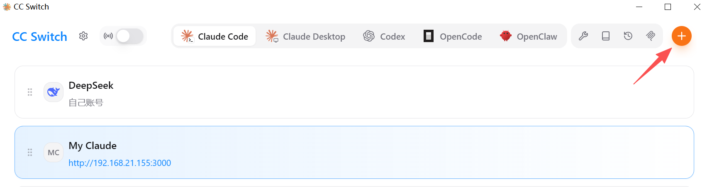

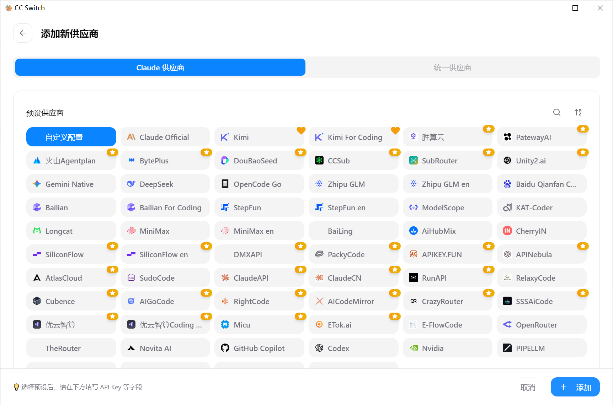

4. 在「Base URL」中填写公司 new-api 平台的地址（问 IT 获取，格式类似 `http://192.168.21.155:3000`）
5. 在「API Key」输入框中粘贴上一步复制的 Key

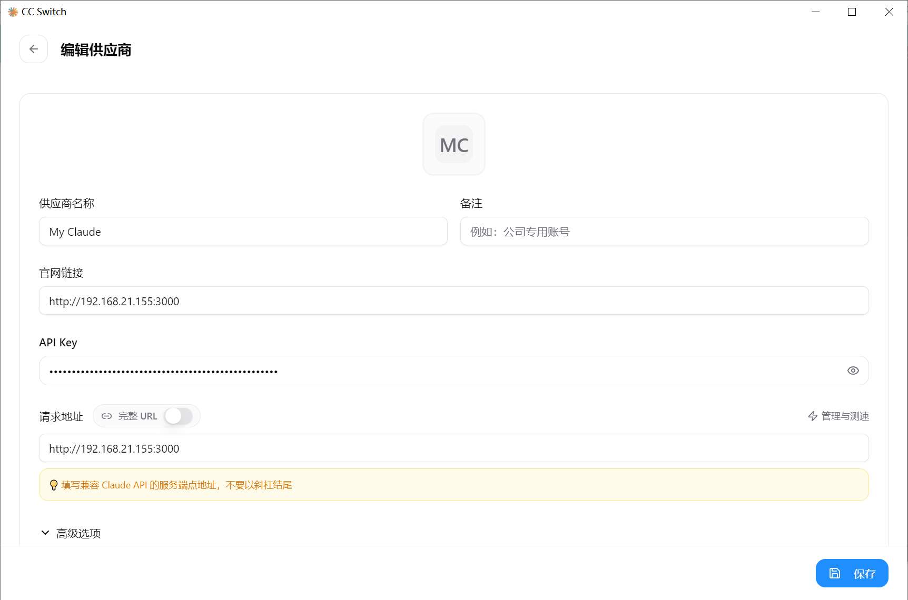

6. 点击「保存」

**⚠️ 常见卡点**

| 现象 | 自救方案 |
|------|---------|
| 不知道公司 new-api 平台地址 | 在内部 IM 里问 "Claude Code 的 API 地址和 Key 怎么获取？"。IT 或 TL 应该能直接回答 |
| API Key 被拒绝或格式提示不对 | ① 确认 Key 没有多余空格（复制粘贴时容易带）② new-api 生成的 Key 通常以 `sk-` 开头，但不同部署可能有不同格式——以平台显示的为准 |
| Base URL 填写后连不通 | 确认末尾**不要**加斜杠（`https://api.company.com` ✅，`https://api.company.com/` ❌）。如果用的是 HTTP 而非 HTTPS，确认地址正确 |
| new-api 平台无法访问 | 可能需要公司 VPN 或内网环境。确认网络连通性 |

### 2.4 供应商高级选项

在供应商编辑窗口中点击「显示高级选项」，可以看到以下配置：

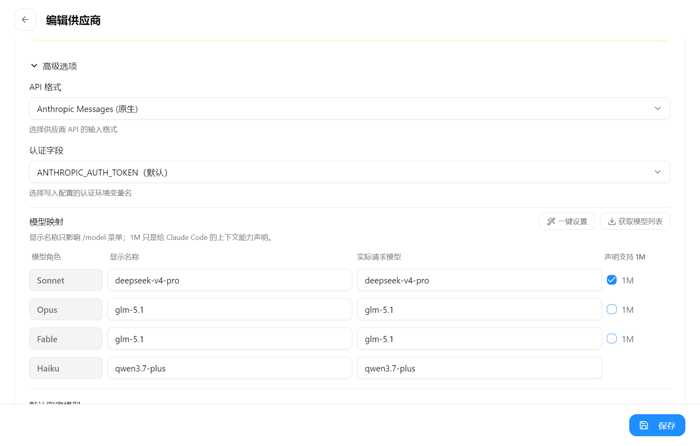

#### API 格式

选择供应商 API 的兼容格式。公司 new-api 平台使用 `Claude API` 格式，默认选择此项即可。其他格式说明：

| 格式 | 说明 |
|------|------|
| **Claude API** | 标准 Anthropic Messages API。new-api 中转平台默认使用此格式 |
| **OpenAI API** | OpenAI Chat Completions 格式。如果供应商提供的是 OpenAI 兼容端点，选此项 |

#### 认证字段

指定 API Key 在 HTTP 请求中的传递方式：

| 字段值 | 效果 |
|--------|------|
| `x-api-key`（默认） | 将 Key 放入 HTTP Header `x-api-key: sk-xxx` |
| `Authorization: Bearer` | 将 Key 放入 HTTP Header `Authorization: Bearer sk-xxx` |

公司 new-api 平台默认使用 `x-api-key`。如果你不确定，两个都试一下——启动 Claude Code 后的报错信息通常会提示正确的认证方式。

#### 获取模型列表

配置模型列表的获取方式：

- **API 获取**：填写模型列表 API 的路径（new-api 中通常是 `/v1/models`）。CC Switch 会调用这个接口自动拉取可用模型列表并填充到模型选择框
- **手动填写**：如果 API 获取不通，可以手动输入模型名称（如 `deepseek-v4-pro`）。手动填写的模型会显示在下拉框中供选择

#### 模型映射

公司 new-api 平台会把外部模型映射为内部模型名。例如：

| 外部模型（上游） | 内部模型名（new-api 显示） |
|-----------------|-------------------------|
| `claude-opus-4-8` | `claude-opus-4-8` |
| `deepseek-v4-pro` | `deepseek-v4-pro` |

在 CC Switch 中填写的模型名**必须与 new-api 平台中显示的内部模型名完全一致**。名称不对会导致 `Model not found` 错误。

#### 声明支持 1M

部分模型（如 Claude Opus 4.8、DeepSeek V4 Pro）支持 100 万 token 的上下文窗口。开启 **「声明支持 1M Context Window」** 可以让 Claude Code 充分利用更大的上下文窗口。

> 注意：开启此选项不代表实际能用满 1M——实际上下文大小受模型和供应商配置的约束。可以在 Claude Code 中输入 `claude --version` 查看当前支持的上下文长度。

#### 默认兜底模型

当主力模型不可用（限流、宕机、维护）时，自动切换到兜底模型：

- 在「默认兜底模型」下拉框中选择一个备用模型
- 兜底模型的 API Key 和 Base URL 可以与主力模型不同
- 切换过程对用户透明——Claude Code 会继续正常工作

> 💡 **建议**：选择与主力模型同一供应商的轻量级模型作为兜底。

### 2.5 启用供应商

在主界面点击供应商卡片的 **「启用」** 按钮。卡片会高亮显示为激活状态。

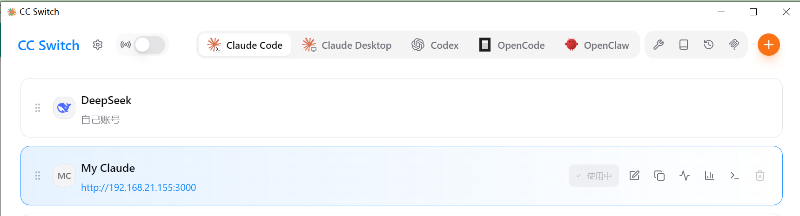

> **切换供应商的生效时机**：CC Switch 通过设置环境变量来工作，这些变量只在**新打开的终端**中生效。所以：
>
> - 首次启用 → 打开新终端，生效
> - 切换供应商 → **关闭当前 Claude Code 会话**，打开新终端，生效
> - 已经运行的 Claude Code 会话不会自动感知切换

### 2.6 首次启动 Claude Code

Claude Code 首次运行时**可能**会弹出初始化引导界面（OAuth 登录提示或账户设置向导）。因为公司通过 CC Switch 配置 API Key 而不是官方账号登录，**这个引导需要跳过**：

1. 在 CC Switch 中进入 **「设置 → 通用」**
2. 开启 **「跳过 Claude Code 初次安装确认」**
3. 关闭设置窗口

> 💡 **这个开关做了什么**：它往 `~/.claude/settings.json` 写入 `"skipIntroduction": true`（以及 `~/.claude.json` 的 `"hasCompletedOnboarding": true`），告诉 Claude Code "已配置完毕，跳过引导"。如果以后卸载重装 Claude Code，这些文件会被删除，引导可能再次出现——再开一次开关即可。
>
> ⚠️ **已知问题**：部分 Claude Code 版本（v2.0.65+）在全新安装时可能忽略 `skipIntroduction` 设置，仍然弹出登录界面。如果遇到：① 确保 CC Switch 已启用供应商 ② 关闭 Claude Code ③ 手动创建 `~/.claude.json`，写入 `{"hasCompletedOnboarding": true}` ④ 重新打开终端启动 `claude`。

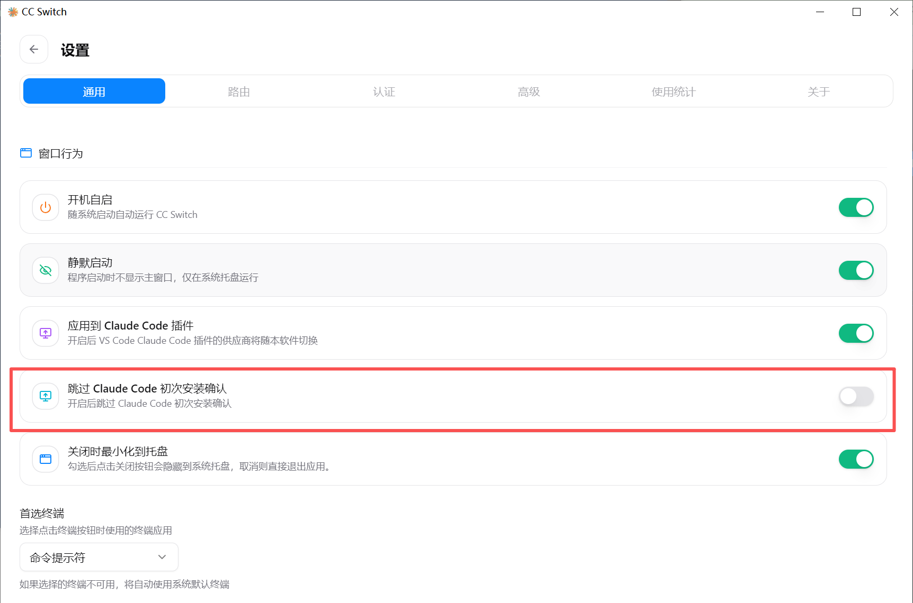

现在**打开一个新终端**，输入：

```bash
claude
```

进入 Claude Code 交互界面后，输入你的第一条消息（**不要复制 `>` 符号本身**——`>` 是终端里的提示符，不是你要输入的内容）：

```
你好，请简单介绍一下自己
```

> ⚠️ **注意**：在 PowerShell 中 `>` 是输出重定向操作符。不要复制 `> 你好，请...` 整行——只复制 `你好，请简单介绍一下自己` 这部分。如果你不小心复制了 `>`，PowerShell 会把它当成重定向命令，可能创建奇怪的空文件。

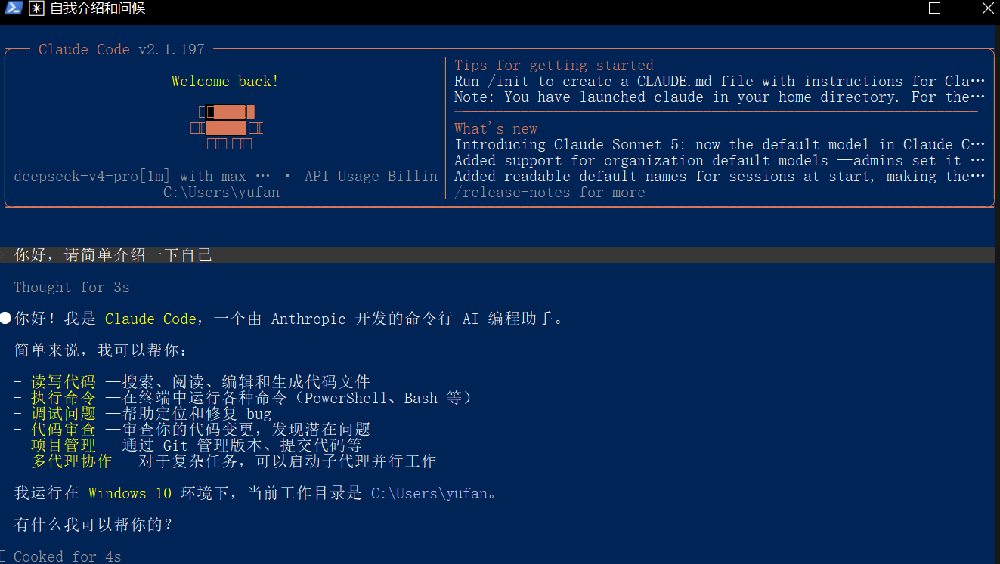

如果 AI 正常回复，🎉 **安装完成！**

**⚠️ 常见卡点：启动后 AI 不回复或报错**

| 现象 | 自救方案 |
|------|---------|
| 启动后一直显示 "Connecting..." 然后超时 | ① 检查 CC Switch 供应商是否已启用 ② 确认 API Key 没有过期 ③ 确认网络能访问供应商地址（在浏览器中打开 Base URL，看能否加载） |
| 报错 `Could not find API key` 或 `ANTHROPIC_AUTH_TOKEN not set` | CC Switch 没有正确注入环境变量。① 确认 CC Switch 在系统托盘中正在运行（右下角图标）② 重新启用一次供应商 ③ 打开一个全新终端（不要复用旧终端） |
| 报错 `401 Unauthorized` 或 `403 Forbidden` | API Key 无效或过期。联系公司 IT 获取新 Key |
| 报错 `Model not found` | 模型名称不匹配。在 CC Switch 编辑供应商，检查「主力模型」字段——常见值如 `deepseek-v4-pro`、`claude-sonnet-4-6`，以供应商文档为准 |
| `claude` 命令不生效，还是提示登录 | ① 确认 CC Switch 已启用供应商 ② **关闭当前终端，重新打开一个新终端**（环境变量只在启动时加载）③ 确认 CC Switch 在系统托盘运行中 ④ 检查「跳过初次安装确认」是否开启 |
| 报错信息包含双斜杠 `//` | Base URL 末尾多了一个 `/`。回到 CC Switch 编辑供应商，去掉末尾斜杠 |
| 网络连接正常但一直超时 | 企业防火墙可能阻断了非标准端口的 API 请求。联系 IT 确认供应商地址的端口（通常是 443）没有被拦截 |
| 首次启动直接显示白屏或闪退 | 检查 Git for Windows 是否安装（`git --version`）。Claude Code 依赖 Git，没有安装会导致启动失败 |

### 2.7 CC Switch 通用设置

CC Switch 的「设置 → 通用」页面包含以下全局配置：

#### JSON Teammates 模式

开启后，Claude Code 的子代理（teammates）在通信时使用 JSON 格式而非纯文本。这能提升多代理协作时的结构化程度和可靠性。**建议开启**。

#### 启用 Tool Search

Claude Code 支持动态搜索和加载 MCP 工具。开启「启用 Tool Search」后，当 Claude Code 需要调用某个未加载的工具时，可以自动搜索并获取其 schema。这是 Claude Code 1.0.160+ 的新能力。**建议开启**。

#### 最大强度思考

部分模型支持 extended thinking（深度推理）。开启「最大强度思考」后，Claude Code 在处理复杂任务时会让模型使用更多的推理 tokens——适合需要深度分析的场景（如复杂架构分析、安全审查），但会略微增加响应时间和 token 消耗。

> 💡 对于日常对话和简单编辑任务，最大强度思考不是必需的。仅在处理复杂问题时有明显收益。

#### 禁用自动升级

Claude Code 默认会自动检查并安装新版本。如果你的公司 IT 策略要求所有软件更新走内部渠道，或者你希望锁定特定版本避免兼容性问题，可以开启「禁用自动升级」。

> ⚠️ 禁用自动升级后，你需要手动关注 Claude Code 的版本更新。建议至少每季度检查一次，避免版本过旧导致功能缺失或安全漏洞。

#### 编辑通用配置

CC Switch 允许直接编辑 Claude Code 的通用配置（`~/.claude/settings.json`），包括：

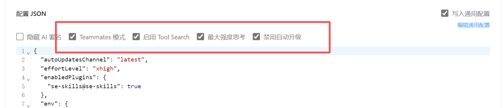

- **跳过初次安装确认**（见下方 2.6 节）：跳过 Claude Code 的 OAuth 引导界面
- **自定义环境变量**：可以设置额外的环境变量（如 `CLAUDE_CODE_DISABLE_NONESSENTIAL_TRAFFIC=1` 关闭遥测）
- **MCP 服务器配置**：在 `mcpServers` 字段中添加和配置 MCP 插件
- **权限规则**：在 `permissions` 字段中预设允许/拒绝的操作

常用配置示例：

```json
{
  "env": {
    "CLAUDE_CODE_DISABLE_NONESSENTIAL_TRAFFIC": "1"
  },
  "permissions": {
    "allow": [
      "Bash(git:*)",
      "Bash(npm:*)",
      "Bash(mkdocs:*)"
    ]
  }
}
```

> 💡 配置的详细语法和更多选项参见 [Claude Code 官方文档](https://docs.anthropic.com/en/docs/claude-code/settings)。

---

## 安装后验证清单

安装完成后，用下面三条消息测试一切正常。**注意：只复制中文内容，不要复制前面的 `>` 符号。**

```bash
# 测试 1：基本对话（在 Claude Code 交互界面中直接输入）
你好，你是什么模型？

# 测试 2：工具调用能力（cd 到你的项目目录后，重新启动 claude）
帮我看看当前目录下有哪些源文件

# 测试 3：代码生成
用 C 语言写一个简单的 GPIO 输出翻转函数，带注释
```

三条都能正常回复 → ✅ 安装成功，可以进入下一篇了。

> 💡 **测试 2 如果返回"没找到文件"**：确认你已经 `cd` 到项目目录。如果目录就是没有代码文件，AI 也会如实告诉你——这说明工具调用（Read/Glob）是正常工作的，不算失败。

---

## 卸载与恢复

如果安装过程出现严重问题，从头来过的步骤：

```bash
# 1. 卸载 Claude Code CLI
npm uninstall -g @anthropic-ai/claude-code

# 2. 清理 Claude Code 配置（可选：保留则下次安装时继承配置）
#    如果你想彻底重置，删除这个目录：
#    C:\Users\<你的用户名>\.claude\

# 3. 卸载 CC Switch
#    开始菜单 → 设置 → 应用 → 找到 CC Switch → 卸载

# 4. 重新从段 1 开始安装
```

## 数据隐私说明

**了解你的数据流向很重要**。当你通过 CC Switch 使用公司配置的 API Key 时：

- 你的代码和对话内容会发送到公司指定的供应商服务器（如 DeepSeek、MiniMax 等），**不会**经过 Anthropic 官方
- 不同供应商对数据的使用政策不同，以公司 IT 确认的供应商隐私政策为准
- Claude Code 默认会向 Anthropic 发送匿名的使用统计（崩溃报告、功能使用分析）。设置环境变量 `CLAUDE_CODE_DISABLE_NONESSENTIAL_TRAFFIC=1` 可以关闭。你可以写到 `~/.claude/settings.json` 中持久化：

```json
{
  "env": {
    "CLAUDE_CODE_DISABLE_NONESSENTIAL_TRAFFIC": "1"
  }
}
```

---

## 常见问题

**Q: 我能否不装 CC Switch 直接用？**

不能。公司不提供个人 Anthropic 账号，而是通过 CC Switch 统一管理 API Key。CC Switch 就是你的"登录"方式。

**Q: 我在家能不能用？**

如果能访问公司 API Key 对应的供应商地址（通常是公网地址），就可以。如果供应商地址有 IP 白名单限制，则需要 VPN 或公司网络。

**Q: Mac 能用吗？**

能。Mac 上 Claude Code 的安装方式相同（`npm install -g @anthropic-ai/claude-code`），CC Switch 提供 `.dmg` 安装包。本文以 Windows 为主，Mac 用户指令相同，截图略有差异。

**Q: CC Switch 里的模型选哪个？**

用公司指定的「主力模型」即可，不需要自己选。如果有多个模型可选（如 "主力模型" 和 "轻量模型"），默认用主力模型——主力模型推理质量更高。

**Q: API Key 到期了怎么办？**

联系公司 IT 续签或更换 Key，在 CC Switch 中编辑对应供应商，替换为新 Key 即可。

---

## 下一步

> **继续阅读：[1-2-基础对话.md](./1-2-基础对话.md)**
>
> 现在你已经有了一台能用的 Claude Code。下一篇教你如何有效提问——让 AI 读懂你的代码、分析问题、帮你修改。
